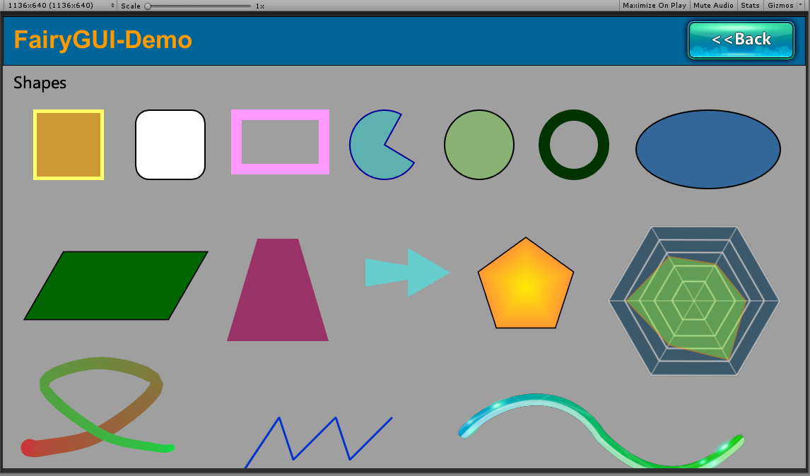
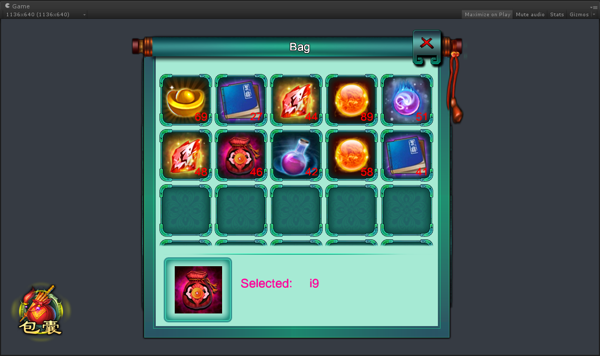
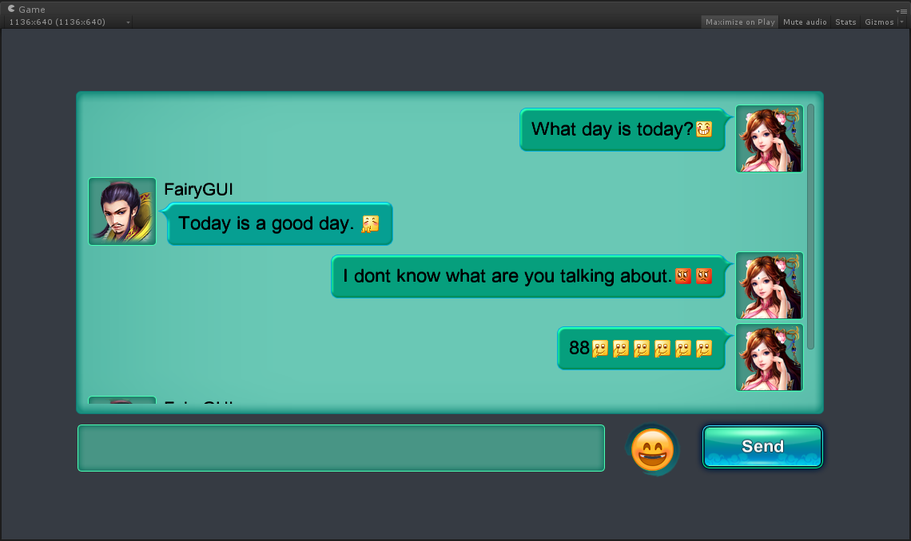
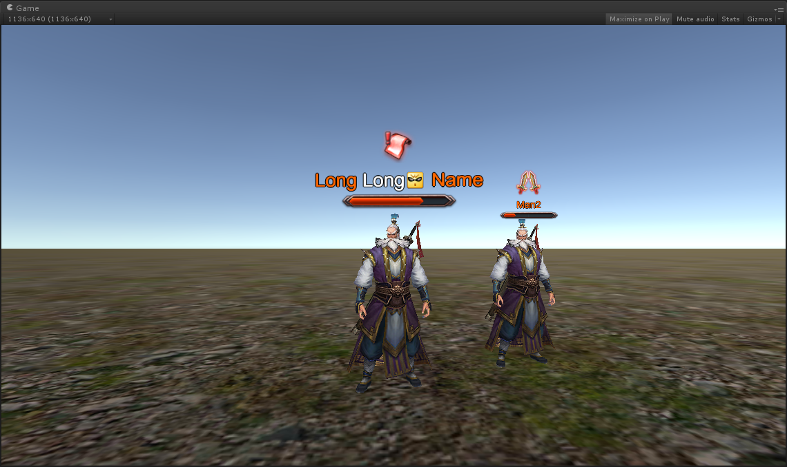
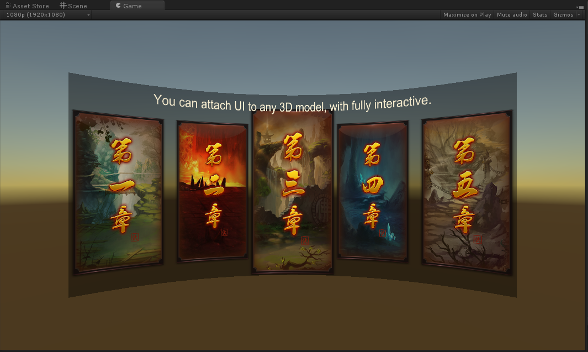
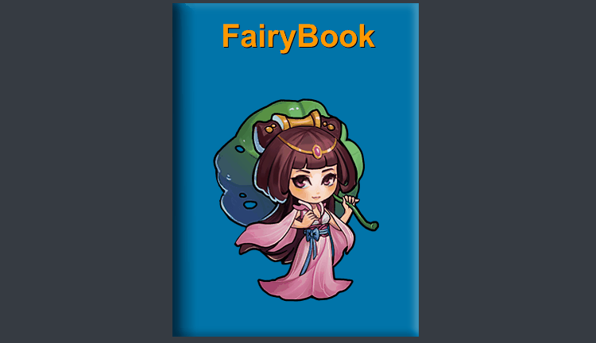

 FairyGUI for Unity
====

FairyGUI is a Cross Platform UI Editor & UI framework.
[Get FairyGUI-Editor](https://en.fairygui.com/product.html)  

Compared with traditional Unity UI engines such as NGUI and UGUI, FairyGUI uses a way of thinking closer to the designer to redefine the production process of the UI, which greatly reduces the time the programmer needs to invest in making the UI. 

In terms of running efficiency, FairyGUI uses the unique `FairyBatching` technology for DrawCall optimization, which is more efficient and easier to control than the traditional optimization techniques of NGUI and UGUI.  

In terms of functionality, FairyGUI has good built-in support for traditional UI production pain points, such as `rich text` (including image and animation), `emoji input` (direct support for keyboard), `virtual list`, `loop list`, `pixel-level hit test`, `curved UI`, `gesture`, `particles and model interspersed UI`, `typing effect`, etc.  

FairyGUI also fully encapsulates all input methods. Whether mouse, single touch, multi-touch, or VR handle input, developers can use the same code to handle interaction. 

The library was designed to work with Unity 5.6 and above, but is currently only tested with Unity 2018 and above.

Learn
====

[Guide](https://en.fairygui.com/docs/guide/index.html)

License
====
MIT
